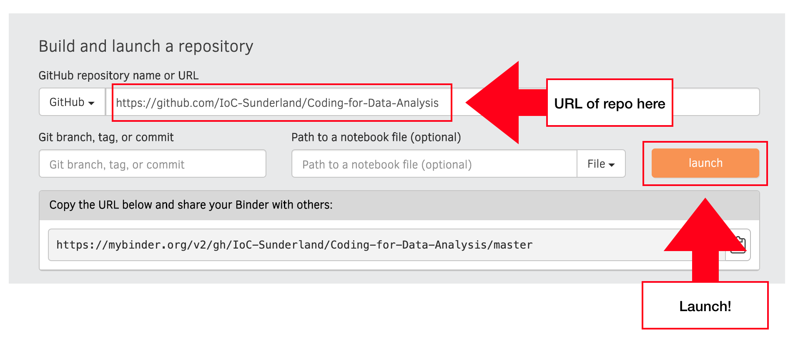

# Coding-for-Data-Analysis
For use in IoC Coding for Data Analysis Course

## Instructions

1. Go to [www.mybinder.org]

2. Complete fields as below:

3. Hit Launch!

## Alternative Instructions:

Launch Notebook directly by clicking [here](https://mybinder.org/v2/gh/IoC-Sunderland/Coding-for-Data-Analysis/master?filepath=Python%20Basics%201.ipynb)

Enjoy!

IoC(Institute of Coding)
