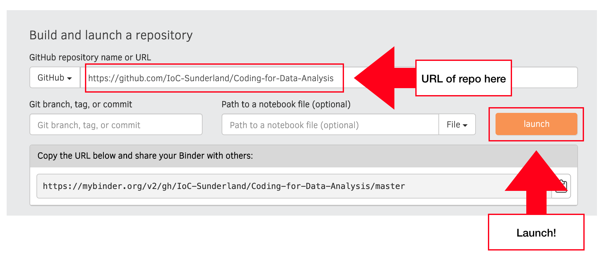

# Coding-for-Data-Analysis

For use in IoC Coding for Data Analysis Course

## Instructions

1. Go to https://mybinder.org/

2. Complete fields as below.

3. Hit Launch!

## Alternative Instructions:

Launch Notebook directly by clicking [here](https://mybinder.org/v2/gh/IoC-Sunderland/Coding-for-Data-Analysis/master)

Enjoy! :tada:

IoC(Institute of Coding)
